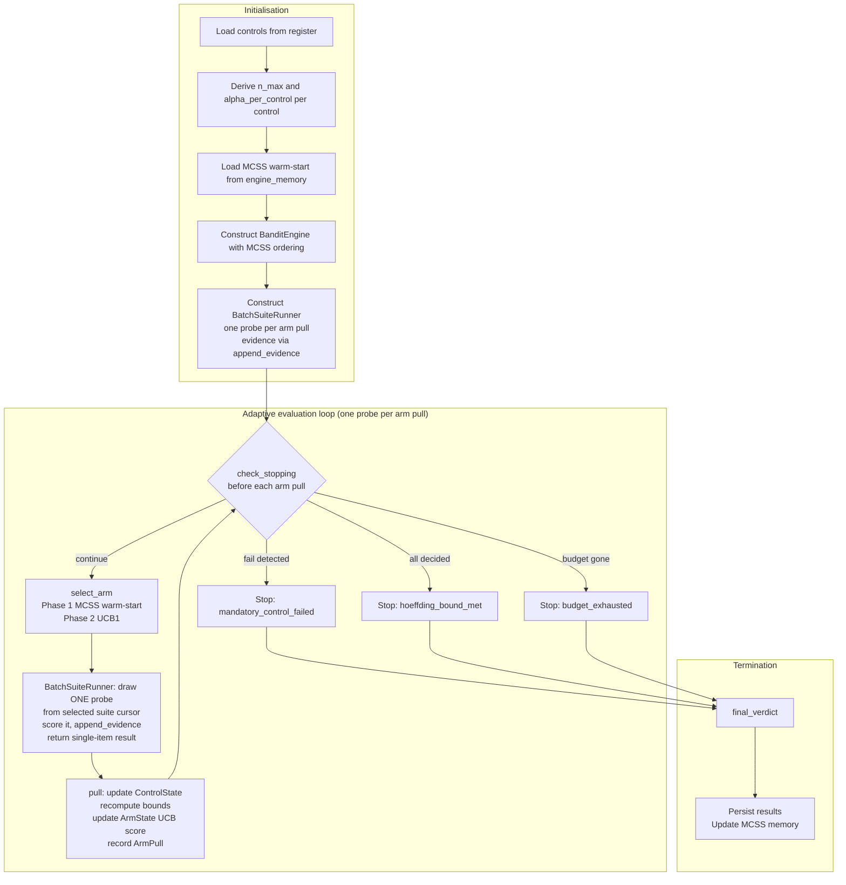
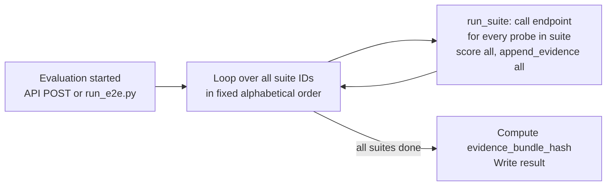
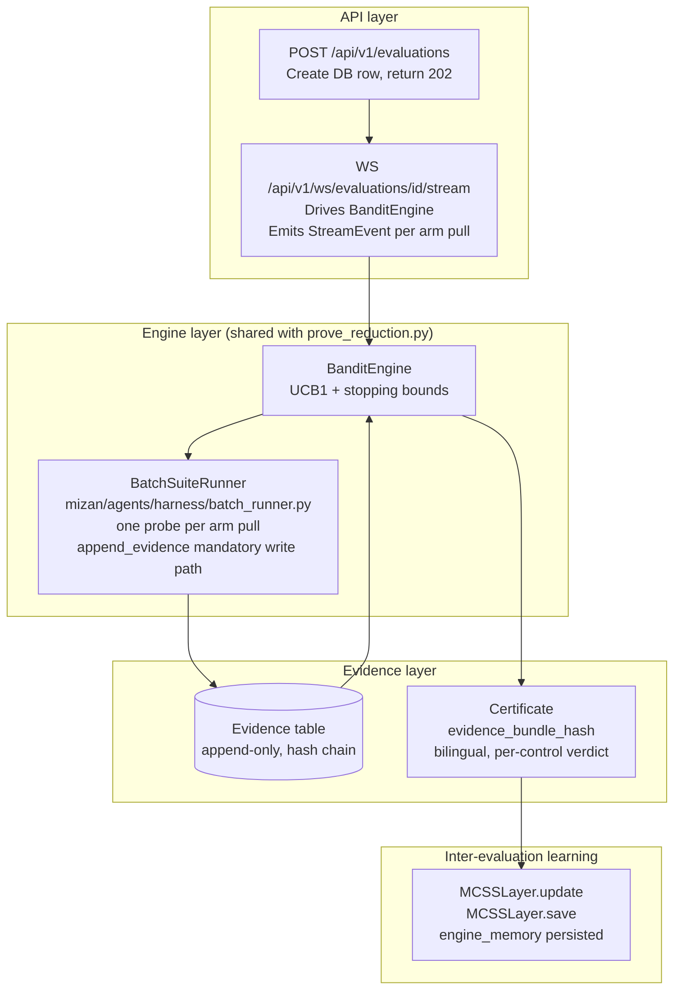

<title>MIZAN Evaluation Flow</title>

# MIZAN: Evaluation Flow

This document answers the question a judge or an integrator asks first:
what runs in what order, and how do the four mechanisms compose?

Read it before reading individual module docstrings or `docs/ARCHITECTURE.md`.

**Current status (as of Wave 1 mid-point):** Two evaluation paths exist
and they are not the same path. The proof script (`scripts/prove_reduction.py`)
runs the adaptive engine with per-probe stopping. The production script
(`scripts/run_e2e.py`) and the API route both run every suite exhaustively
without the engine. The measured reduction comes from the proof path; a judge
exercising the demo exercises the exhaustive path. This gap is named rather
than smoothed over; closing it is the primary wiring task of this section.

---

## The four mechanisms and their jobs

**UCB1 (BanditEngine):** decides where to spend the next probe.
It selects the suite arm that has the highest expected information gain
toward the certification decision, given what has been learnt so far.

**Stopping bounds (ControlState):** decide whether a control is finished.
After each arm pull, the engine recomputes the Clopper-Pearson lower bound
(for passing controls) and the Hoeffding upper bound (for failing controls)
against the required pass rate. A control is decided when the bound clears
the threshold or when budget is exhausted.

**Control register (use\_cases.json and the controls table):** decides what
"finished" means for each control. It supplies `pass_threshold`,
`threshold_direction`, `is_mandatory`, and `suite_id`. From these the engine
derives `required_pass_rate`, `n_max`, and `alpha_per_control`. The register
is read once at evaluation start; it does not change mid-evaluation.

**MCSS (MCSSLayer):** decides where to start next time. After a completed
evaluation it absorbs the arm-pull record and updates historical mean reward
per suite. The next evaluation of the same use-case class starts with arms
ordered by descending historical mean, so UCB1 inherits a warm-start rather
than a random start. MCSS runs once before and once after each evaluation;
it does not run during one.

---

## Two current paths

### Path A: proof path (prove\_reduction.py)

This is the path that produces the measured reduction figures.



**Granularity**: one arm pull equals one probe. Stopping bounds are
re-evaluated between every probe. A control can stop the moment its bound
clears; the remaining probes for that control are never drawn.

This is how the non-compliant model rejection rate moves from 57.9 percent
(budget exhaustion only) to 83.2 percent (early stop on bound). [source:
docs/evidence/reduction\_report.md]

`BanditEngine` is constructed at lines 1001 and 1140 of
`scripts/prove_reduction.py`. It appears nowhere in the API or in
`scripts/run_e2e.py`.

### Path B: production path (run\_e2e.py and API, pre-wiring)

This is the path a user or judge exercises today.



**No stopping.** All suites run to completion regardless of control state.
**No UCB1.** Suite selection order is fixed.
**No MCSS.** No warm-start, no inter-evaluation learning.
**No engine in the API.** The evaluation route stores records in-memory and
returns fixture data. The websocket route sends three synthetic `StreamEvent`
objects and closes.

### Gap statement

The adaptive engine is not a component with a missing connector. It is not
in the production path at all. The proof script, the test suite, and the
production path are three separate implementations of the evaluation loop
with no shared runner. A judge who exercises the demo exercises Path B.
The Fatima journey (budget reallocation live, confidence bounds tightening,
early stops firing with a stated reason) requires Path A in the production
API. It currently has no producer.

---

## Target architecture (post-wiring)

Once the wiring task below is complete, Path A and the production API share
the same runner implementation. The diagram in this section describes the
target state; the gap section above describes today.



`scripts/run_e2e.py --adaptive` exercises the same `BanditEngine` and
`BatchSuiteRunner` that the API uses, so the end-to-end script is a
reproducible offline version of what the API does.

---

## Sequence by time (target state)

### Phase 0: submission (once)

1. `POST /api/v1/evaluations` creates a database row (status `running`)
   for a `(model_id, use_case_id)` pair.

2. The control register is read. For the selected use case, every control
   record supplies: `control_id`, `suite_id`, `is_mandatory`,
   `pass_threshold`, `threshold_direction`.

3. The engine derives per control:
   - `required_pass_rate = _derive_required_pass_rate(pass_threshold, direction)`
   - `n_max = _min_probes_for_statistical_pass(required_pass_rate, alpha_per_control)`
   - `alpha_per_control = (1 - confidence_threshold) / K_mandatory`

4. `MCSSLayer.load()` reads `engine_memory` for this use-case class and
   returns a warm-start ordering (or declaration order if no prior evaluation).

5. `BanditEngine` is constructed with `mcss_ordering` fixed.
   `BatchSuiteRunner` is constructed with the evaluation's endpoint and
   mandatory control IDs.

### Phase 1: adaptive evaluation loop

The loop calls `check_stopping()` before each arm pull:

1. Any mandatory control has `decision() == False`: stop (`mandatory_control_failed`).
2. All mandatory controls have `is_decided() == True`: stop (`hoeffding_bound_met`).
3. `total_queries >= total_budget`: stop (`budget_exhausted`).

When the loop continues, `select_arm()` runs:

**Phase 1 (warm-start).** While any unvisited arm covers an undecided
mandatory control, select the first such arm in MCSS priority order.
Deterministic; no random tie-breaking.

**Phase 2 (UCB1).** Once all arms are visited, select by maximum UCB1 index
(exploration bonus `sqrt(log(t)/n_i)`, constant `c = sqrt(2)`). Ties broken
by seeded RNG for determinism.

`BatchSuiteRunner.__call__(suite_id, control_ids)` is called. It draws
**one probe** from the suite's cursor, calls the model endpoint, scores the
response, and writes one evidence row via `append_evidence()`.

`pull(arm_index, probe_results)` updates `ControlState` (n, s, bounds) and
`ArmState` (pulls, UCB score). One `ArmPull` is recorded and emitted as a
`StreamEvent` over the websocket.

### Loop invariant (target state)

After every arm pull (one probe), the following are current:

- `p_hat_k = s_k / n_k` for every control.
- Clopper-Pearson lower bound `p_lower_k` (STATISTICAL\_PASS check).
- Hoeffding half-width `epsilon_k` (STATISTICAL\_FAIL fallback check).
- UCB1 index for every arm.

The following are NOT recomputed until the next arm pull:

- MCSS memory (updated at evaluation termination only).

### Phase 2: termination

1. `final_verdict()`: certified or rejected.
2. Certificate row written with `evidence_bundle_hash`.
3. `MCSSLayer.update(arm_pulls)` and `MCSSLayer.save()`.

---

## What is currently unexercised

**CLEAN\_RUN\_BOUNDED.** Zero-tolerance controls (required\_pass\_rate ==
1.0) use the Clopper-Pearson upper bound path. GOVERNANCE Wave 1 converted
all seven zero-tolerance probe controls to `evidence_type: "attestation"`.
The path is implemented and tested but unreachable in the current control
register. It remains correct for future use cases.

**MCSS compounding benefit.** The end-to-end measurement that mean
probes-to-verdict decreases across successive evaluations of the same
use-case class is a Wave 2 deliverable (`scripts/prove_reduction.py`
produces the graph stub).

---

## Adapter contract

The interface between `BanditEngine` and `HARNESS` is a callable with the
signature:

```
suite_runner(suite_id: str, control_ids: list[str]) -> list[dict]
```

Each returned dict must contain: `control_id` (str), `probe_id` (str),
`passed` (bool or int), `score` (float).

In the proof path, `BatchSuiteRunner.__call__` implements this interface.
In production, the same class (extracted to
`mizan/agents/harness/batch_runner.py`) is the canonical implementation.
`MockSuiteRunner` in `tests/test_bandit_engine.py` implements it for tests.

Three separate implementations of one unnamed interface is how the paths
diverged. The name is now: `ProbeSource`. Specification is in
`docs/ARCHITECTURE.md` section 8.

---

*Maintained by ARCHITECT. Any change to the evaluation loop, stopping
criteria, MCSS update timing, or the `ProbeSource` interface must be
reflected here before the wave gate. If the composition described here
diverges from the code, the code is the authority.*
