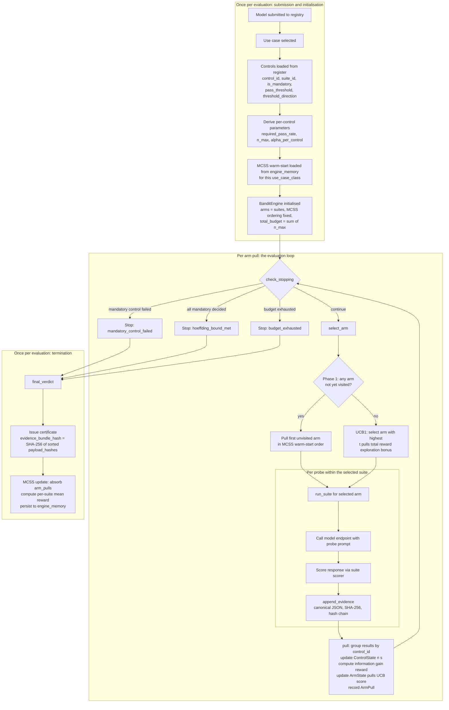

<title>MIZAN Evaluation Flow</title>

# MIZAN: Evaluation Flow

This document answers the question a judge or an integrator asks first:
what runs in what order, and how do the four mechanisms compose?

Read it before reading individual module docstrings or DECISIONS.md.

---

## The four mechanisms and their jobs

**UCB1 (BanditEngine):** decides where to spend the next probe.
It selects the suite arm that has the highest expected information gain
toward the certification decision, given what has been learnt so far.

**Stopping bounds (ControlState):** decide whether a control is finished.
After each arm pull, the engine recomputes the Clopper-Pearson lower bound
(for passing controls) and the Hoeffding upper bound (for failing controls)
against the required pass rate. A control is decided when the bound clears
the threshold or when budget is exhausted.

**Control register (use_cases.json and the controls table):** decides what
"finished" means for each control. It supplies `pass_threshold`,
`threshold_direction`, `is_mandatory`, and `suite_id`. From these the
engine derives `required_pass_rate`, `n_max` (the per-control probe budget),
and `alpha_per_control` (the per-control error allowance). The register is
read once at evaluation start; it does not change mid-evaluation.

**MCSS (MCSSLayer):** decides where to start next time. After a completed
evaluation it absorbs the arm-pull record and updates historical mean reward
per suite. The next evaluation of the same use-case class starts with arms
ordered by descending historical mean, so UCB1 inherits a warm-start rather
than a random start. MCSS runs once before and once after each evaluation;
it does not run during one.

---

## Full flow diagram



---

## Sequence by time

### Phase 0: submission (runs once)

1. A `POST /api/v1/evaluations` request creates an evaluation row
   (status `running`) for a `(model_id, use_case_id)` pair.

2. The control register is read. For the selected use case, every control
   record supplies:
   - `control_id`, `suite_id`, `is_mandatory`
   - `pass_threshold` (float in [0, 1])
   - `threshold_direction` (`"at_least"` or `"at_most"`)

3. From these, the engine derives per control:
   - `required_pass_rate = _derive_required_pass_rate(pass_threshold, direction)`
   - `n_max = _min_probes_for_statistical_pass(required_pass_rate, alpha_per_control)`
   - `alpha_per_control = (1 - confidence_threshold) / K_mandatory`
   where `K_mandatory` is the number of mandatory controls and
   `confidence_threshold` is the use case's minimum confidence (e.g., 0.97
   for citizen\_chatbot). [source: mizan/engine/bandit/allocator.py lines 694-698]

4. `MCSSLayer.load(use_case_class, suite_ids, session)` reads
   `engine_memory` for this use-case class and returns a warm-start ordering
   of suite arms, sorted by descending historical mean reward per probe.
   If no prior evaluation exists, the ordering is the declaration order
   from the register.

5. `BanditEngine.__init__` is called with `mcss_ordering` set to the
   warm-start. The total probe budget is `sum(n_max for all mandatory controls)`
   unless `engine_config` supplies a `total_budget` override.
   The MCSS ordering is **fixed** at this point; it does not change during
   the evaluation.

### Phase 1: the evaluation loop

The loop calls `check_stopping()` before each arm pull. Stopping criteria
are evaluated in this priority order:

1. Any mandatory control has `decision() == False` (STATISTICAL\_FAIL or
   ZERO\_VIOLATION\_FAIL): stop immediately (`mandatory_control_failed`).
2. All mandatory controls have `is_decided() == True`: stop
   (`hoeffding_bound_met`).
3. `total_queries >= total_budget`: stop (`budget_exhausted`).

When the loop continues, `select_arm()` runs in two phases:

**Phase 1 (warm-start).** While any arm covering an undecided mandatory
control has not yet been pulled, select the first such arm in MCSS priority
order. This is deterministic: no random tie-breaking. MCSS has already
ranked arms by historical yield; the engine follows that ranking before
using its own observations.

**Phase 2 (UCB1).** Once every arm has been pulled at least once, select
the arm with the highest UCB1 index:

```
UCB1(i) = mean_reward(i) + c * sqrt(log(t) / n_i)
```

where `t` is total arm pulls so far, `n_i` is pulls for arm `i`, and
`c = sqrt(2)` (Auer et al., 2002). Arms whose mandatory controls are all
decided are excluded. Ties are broken with a seeded RNG for determinism.

After arm selection, `run_suite(suite_id, ...)` is called. For each probe
in the selected suite:

- The model endpoint is called with the probe prompt.
- The response is scored by the suite-specified scorer.
- `append_evidence()` writes one row: canonical JSON payload, SHA-256
  payload hash, and `chain_prev_hash` linking to the previous row.

This is the only granularity at which evidence is written: one row per probe.

After all probes complete, `pull(arm_index, probe_results)` runs:

- Probe results are grouped by `control_id`.
- For each mandatory control touched, information gain is computed:
  `IG_k = H(p_hat_k_before) - H(p_hat_k_after)` where `H` is binary entropy.
- `ControlState.n` and `ControlState.s` are updated (total probes, passing probes).
- `ArmState.pulls`, `ArmState.total_reward` are updated.
- One `ArmPull` record is appended to the evaluation's trail.

### Loop invariant

After every arm pull, the following quantities are current:

- `p_hat_k = s_k / n_k` for every control `k`.
- The Clopper-Pearson lower bound `p_lower_k` (used for `STATISTICAL_PASS`).
- The Hoeffding half-width `epsilon_k` (used for `STATISTICAL_FAIL` fallback).
- The UCB1 index for every arm.

The following quantities are NOT recomputed until after the next complete
arm pull:

- Individual probe scores within the current suite run. No stopping fires
  mid-suite. Once a suite arm is selected, all its probes run to completion.
- MCSS memory. It is updated only at evaluation termination, not per pull.

### Phase 2: termination

When any stopping criterion fires:

1. `final_verdict()` is called. It returns `certified` only when every
   mandatory control passed. A control that is undecided at budget exhaustion
   is evaluated on its empirical pass rate `p_hat` versus `required_pass_rate`.

2. A certificate row is written with:
   - `verdict`: certified or rejected.
   - `evidence_bundle_hash`: SHA-256 of the sorted payload hashes of all
     evidence rows for this evaluation.
   - `certificate_data`: per-control verdict breakdown, each stating the
     decision basis (STATISTICAL\_PASS, BUDGET\_PASS, BUDGET\_FAIL, or for
     attestation controls: attestation\_pass or attestation\_fail).

3. `MCSSLayer.update(arm_pulls)` absorbs the completed evaluation's arm-pull
   record and updates per-suite mean reward using an online cumulative mean.

4. `MCSSLayer.save(session)` persists to `engine_memory`. The next evaluation
   of the same use-case class will load this updated state.

### Inter-evaluation: what MCSS does and does not do

MCSS accumulates one data point per completed evaluation. On the first
evaluation of a use-case class, the ordering is the register's declaration
order. On the second, it is ranked by the first evaluation's arm rewards.
The improvement is measurable as mean probes-to-verdict decreasing as
`total_evaluations` grows against a random-ordering baseline. The
`prove_reduction.py` script in Wave 2 will produce this graph.

MCSS does not search the exponential space of all orderings via tree rollouts.
The arm space is small (at most eight suites), and UCB1 already handles
exploitation within each evaluation. MCSS adds inter-evaluation warm-starting
only.

---

## What is currently unexercised

**CLEAN\_RUN\_BOUNDED.** The code path that handles zero-tolerance controls
via Clopper-Pearson upper bounds (required\_pass\_rate == 1.0, zero violations
observed, budget exhausted) is implemented and tested but currently
unreachable in the demo configuration. GOVERNANCE Wave 1 converted all seven
zero-tolerance probe controls to `evidence_type: "attestation"`. Attestation
controls are scored by reading the model card, not by sending probes to the
endpoint, and they do not interact with the Hoeffding or Clopper-Pearson
stopping logic. The CLEAN\_RUN\_BOUNDED path remains correct for future use
cases that introduce a genuine zero-tolerance probe control.

**MCSS compounding benefit.** The end-to-end demonstration that mean
probes-to-verdict decreases as total evaluations of the same use-case class
increases is not yet produced. The mechanism is implemented and the
`prove_reduction.py` script exists as a stub. The graph is a Wave 2
deliverable. The mechanism's correctness is asserted by
`test_bandit_engine.py` test 6 (MCSS ordering improves with accumulated
evaluations) against a synthetic fixture.

---

## Integration gap: suite\_runner adapter

`BanditEngine.run_sync` calls `suite_runner(suite_id, control_ids)` where
`control_ids` is the list of mandatory controls not yet decided. This is the
interface the evaluation loop depends on.

`runner.run_suite(suite_id, model_endpoint, locale, evaluation_id, context)`
is the HARNESS implementation. These signatures do not match directly.

The closure or adapter object that wraps `run_suite` into the
`(suite_id, control_ids) -> list[dict]` interface that `BanditEngine`
expects has not been committed to the repository. `MockSuiteRunner` in
`test_bandit_engine.py` fills this role in tests. HARNESS must provide the
production equivalent before end-to-end evaluation can run.

This is a design gap, not a documentation gap. It is raised here because
the reviewer asked how the components compose, and the answer at this
boundary is: they do not yet compose in committed code.

---

## Summary table

| When | What runs | Granularity |
|---|---|---|
| Once at submission | Load control register, derive n\_max and alpha\_per\_control, load MCSS warm-start, initialise BanditEngine | Per evaluation |
| Before each arm pull | check\_stopping (fail, all-decided, budget) | Per arm pull |
| Each arm pull, Phase 1 | select\_arm: follow MCSS warm-start order | Per arm pull (until all arms visited once) |
| Each arm pull, Phase 2 | select\_arm: UCB1 index maximisation | Per arm pull (after warm-start exhausted) |
| Within each arm pull | run\_suite: per-probe endpoint call, scoring, append\_evidence | Per probe |
| After each arm pull | pull(): update ControlState and ArmState, recompute bounds and UCB scores, record ArmPull | Per arm pull |
| At termination | final\_verdict, issue certificate, update and persist MCSS memory | Per evaluation |

---

*Maintained by ARCHITECT. Any change to the evaluation loop, the stopping
criteria, the MCSS update timing, or the suite\_runner interface must be
reflected here before the wave gate. If the composition described here
diverges from the code, the code is the authority; update this document.*
