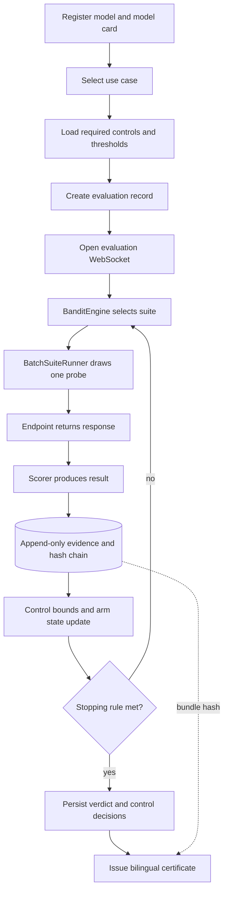

<title>MIZAN Evaluation Flow</title>

# MIZAN evaluation flow

This document describes the code path that runs today. Read it before the
individual module contracts in [`ARCHITECTURE.md`](ARCHITECTURE.md).

## System path



The API WebSocket, `scripts/run_e2e.py --adaptive` and the proof script all use
`BanditEngine` with `BatchSuiteRunner`. The command-line runner also retains an
explicit exhaustive mode so the adaptive result can be compared with a full
fixed-order corpus run.

## 1. Registration

`POST /api/v1/models` records the model identity, intended endpoint, declared
evaluation profile and structured model card. The current demonstration does
not call the declared endpoint. A missing live adapter resolves to the
deterministic `MockEndpoint`, and the serving mode is recorded on the
certificate so a mock evaluation cannot be mistaken for a live one.

## 2. Evaluation creation

`POST /api/v1/evaluations` validates that the model and use case exist, inserts
the evaluation row and loads the use-case control set. Each control supplies:

- `control_id` and `suite_id`;
- whether it is mandatory;
- its pass threshold and threshold direction;
- its weight and evidence type; and
- the confidence threshold inherited from the use case.

The engine derives the per-control required pass rate, statistical budget and
joint-confidence allocation from these fields. Callers can provide documented
engine overrides, but the default budget comes from the register.

The route returns before probes run. The evaluation starts when the client opens
`WS /api/v1/ws/evaluations/{id}/stream`.

## 3. Adaptive loop

The WebSocket handler constructs a `BatchSuiteRunner` and `BanditEngine`, then
runs the synchronous engine in a worker thread while forwarding events through
an asynchronous queue.

Before each arm pull, the engine checks:

1. whether any mandatory control has failed;
2. whether every mandatory control has been decided; and
3. whether the total evaluation budget is exhausted.

If evaluation continues, suite selection has two phases.

### Initial coverage

Every unvisited suite covering an undecided mandatory control receives an
initial pull in a deterministic order. `BanditEngine` supports an MCSS-derived
warm-start ordering when one is supplied.

The API and headline reduction proof do not currently load or persist that
warm-start. Cross-evaluation compounding is therefore a research path, not a
property of the live API or the published reduction figure.

### UCB1 allocation

After initial coverage, UCB1 chooses the suite with the greatest upper
confidence index. A seeded random generator breaks exact ties, so repeated runs
with the same inputs remain reproducible.

`BatchSuiteRunner.__call__(suite_id, control_ids)` draws one probe from the
suite cursor, calls the endpoint, scores the response and appends one evidence
row. Stopping is reconsidered between probes, so a decided control does not
needlessly consume the rest of its corpus.

## 4. Control decisions

After every probe, the matching `ControlState` updates its sample count, pass
count and bounds. Decision bases remain distinct:

- a statistical pass or failure comes from a configured confidence bound;
- a budget pass or failure means the available probe budget ended first;
- a zero-violation decision uses the exact binomial path;
- an attestation decision comes from declared documentary evidence rather than
  model output; and
- an undecided control remains visible as undecided.

The certificate and interface must preserve this distinction. A budget-limited
pass is not silently promoted to a statistically demonstrated pass.

## 5. Evidence path

Every probe result passes through `append_evidence()`. The data layer computes
the canonical payload hash rather than accepting a caller-supplied value. Each
row includes the previous row hash for the same evaluation, and database
triggers reject updates and deletions.

This detects changes made through the normal database boundary and makes an
evidence bundle reproducible. It does not stop an administrator with direct file
access from replacing the database and recomputing the chain. External hash
publication remains roadmap work.

## 6. Termination and certificate

At termination the WebSocket handler:

1. computes the final verdict and per-control decision record;
2. persists status, arm pulls, stopping reason and query count;
3. updates the registered model status;
4. issues the bilingual certificate; and
5. emits a final `stop` event containing the certificate identifier and evidence
   bundle hash.

The current certificate signature is a prototype boundary. Deployment-grade,
externally verifiable signing and key management are not yet implemented.

## 7. Proof and comparison paths

`scripts/prove_reduction.py` runs adaptive and exhaustive evaluation against the
same corpus and decision rules, then asserts verdict and control-level parity.
Its report distinguishes endpoint calls from evidence rows and publishes full
seed distributions where applicable.

`scripts/run_e2e.py` exposes both modes:

```bash
uv run python scripts/run_e2e.py --adaptive
uv run python scripts/run_e2e.py
```

The adaptive form mirrors the API's engine and runner. The default form runs all
suites in fixed order and exists as a reproducible baseline, not as the path
served by the evaluation WebSocket.

## 8. Static interface mode

The production web build can be deployed without the Python engine. In that
mode it replays evaluation traces exported by
`scripts/export_demo_runs.py`. The interface labels the traces as recorded and
does not imply that the browser is executing a live evaluation.

## 9. Adapter contract

The engine consumes a probe source with this shape:

```text
suite_runner(suite_id: str, control_ids: list[str]) -> list[dict]
```

Each returned item contains at least `control_id`, `probe_id`, `passed` and
`score`. `BatchSuiteRunner` is the canonical implementation. Test doubles use
the same contract to exercise allocation and stopping without an endpoint or
database.

## 10. Current operational limits

- Evaluation orchestration uses in-process state alongside SQLite, so it is not
  safe for multiple API workers or process restarts during a run.
- The WebSocket path currently uses deterministic mock endpoints rather than the
  submitted live endpoint URL.
- MCSS warm-start ordering is implemented and measured separately but is not
  wired into the API or headline reduction proof.
- PostgreSQL migrations, external key management, identity and tenant isolation
  remain production-readiness work.
- Corpus size is insufficient for many passing controls to earn the configured
  statistical bound; the certificate reports those as budget decisions.

Changes to the evaluation loop, stopping rules, evidence path or probe-source
contract must update this document in the same pull request.
